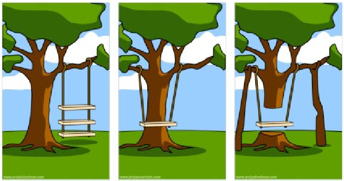
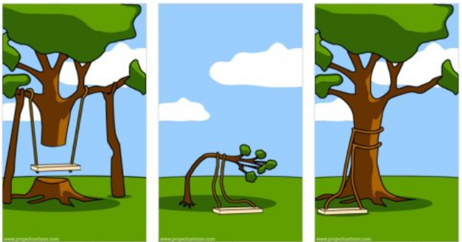
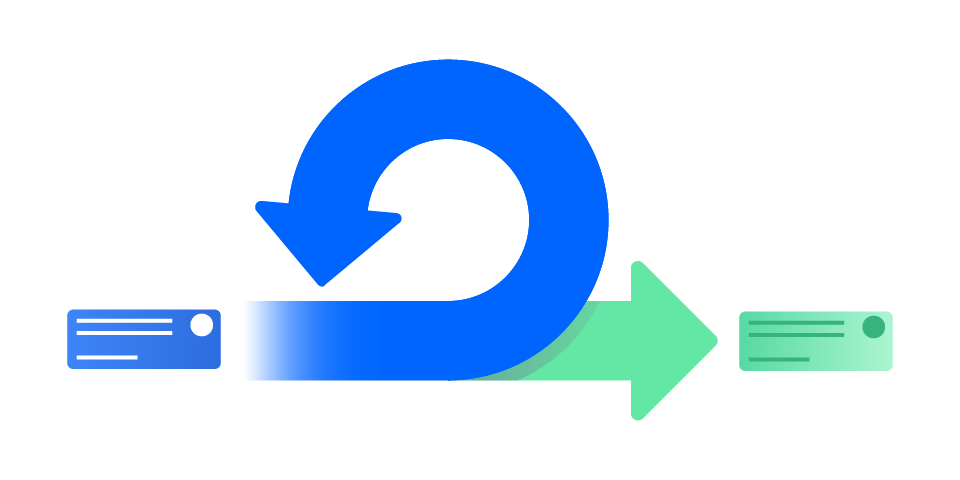
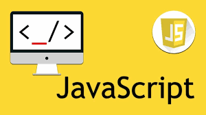
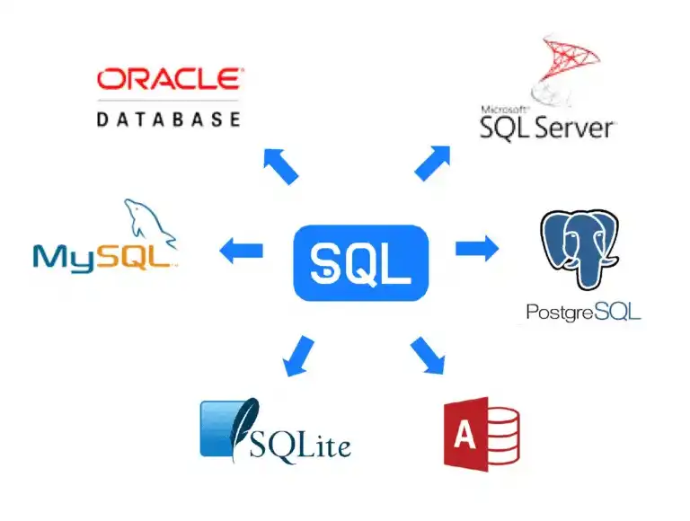
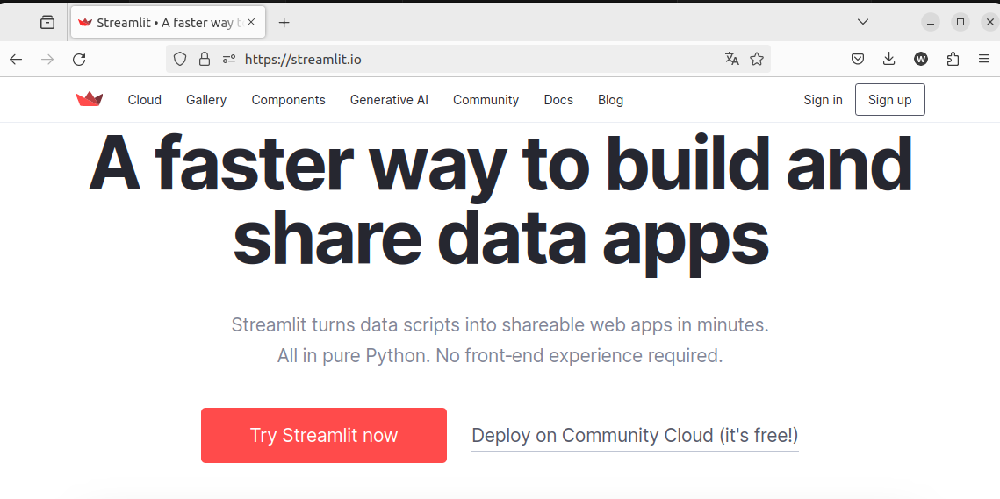
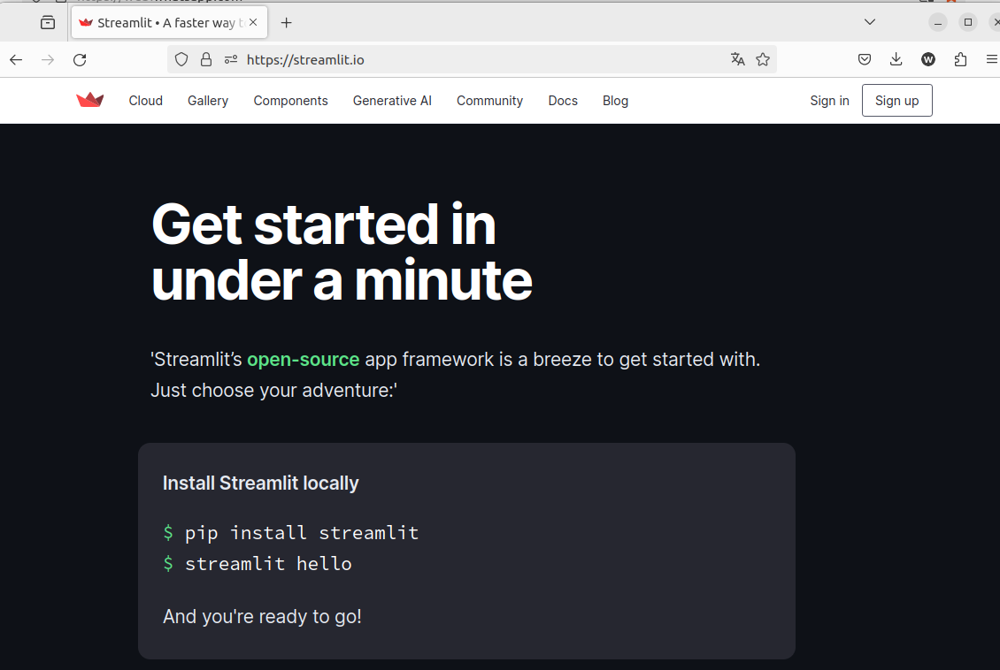

---


---
# Quem somos?
- Allan Ribeiro
- Wesley Seidel

---
### Allan Ribeiro

Contador de formação pela UNAMA e especialista em Ciência de Dados pelo Mackenzie, encontrei meu caminho na interseção entre números e tecnologia. Apaixonado por explorar padrões dos dados e desvendar seus segredos através da programação. Fora das telas, me aventuro pelas artes marciais, especialmente no mundo do Muay Thai.

---
### Wesley Seidel 
<style scoped>
.columns {
  gap: 1rem;
  display: grid;
  grid-template-columns: minmax(0, 6fr) minmax(0, 2fr)
}
</style>


<div class="columns">
  <div>

- Empreendedor data driven e agilista.
- Atualmente doutorando na USP, onde também obteve o título de mestre em Ciência da Computação. 
- Esp. em BD pela UFPa, Matemática-UEPa,. 
- Ainda tem muito a aprender! 
- Preguiçoso que sou, usei uma LLM para escrever essa minibio.
</div>
<div>


</div>
</div>

---
 |  |  | 


---
### O que é um protótipo ?
<style scoped>
.columns {
  gap: 1rem;
  display: grid;
  grid-template-columns: minmax(0, 3fr) minmax(0, 3fr)  minmax(0, 3fr);
}
</style>
<div class="columns">
  <div>


</div>
<div>




</div>
<div>


</div>

<div>


---

---
# O que é um protótipo ?
- **protótipo**:
  - do grego  prótos (primeiro); 
  - typos (tipo)

- **Prototipação** é o processo de criação de um protótipo.

- **Objetivos** (alguns):
  - POC (Prova de Conceito)
  - MVP (Mínimo Produto Viável)


---
### Ainda sobre protótipo:
- A ideia é que com a utilização do protótipo, possamos obter mais feedback e insights para alcançar o objetivo do produto final.

- IMPORTANTE:
  - Podemos pensar nele como sendo um esboço, um rascunho da ideia, e que nos permite testar e validar conceitos antes de investir mais tempo e recursos no desenvolvimento completo.


---
### Ciclo de desenvolvimento:



---
### Linguagens / Ferramentas / Frameworks  ...
    

 

---
### Bancos de dados / Dados / Dados ... 



---
### Bancos de dados / Dados / Dados ... 


---
# Streamlit




---
<style>
img[alt~="center"] {
  display: block;
  margin: 0 auto;
}
</style>




---
### Preparando ambiente 

```console
# Criando o ambiente virtual
$ pyenv virtualenv streamlit_hello

# Ativando o ambiente virtual
$ pyenv activate streamlit_hello
```

---
<!-- slide -->
## Instalando o Streamlit

```shell
$ pip install streamlit   #  OU pip install -r requirements.txt
```


#### Curiosidade: Quais pacotes foram instalados como dependencias do Streamlit? 
```shell
$ pip freeze > requirements-freeze.txt
```

--- 
<!-- slide -->
### Testando a  instalação
```shel 
$ streamlit           
Usage: streamlit [OPTIONS] COMMAND [ARGS]...

  Try out a demo with:

      $ streamlit hello

  Or use the line below to run your own script:

      $ streamlit run your_script.py

Options:
  --log_level [error|warning|info|debug]
  --version                       Show the version and exit.
  --help                          Show this message and exit.

Commands:
  activate  Activate Streamlit by entering your email.
  cache     Manage the Streamlit cache.
  config    Manage Streamlit's config settings.
  docs      Show help in browser.
  hello     Runs the Hello World script.
  help      Print this help message.
  run       Run a Python script, piping stderr to Streamlit.
  version   Print Streamlit's version number.
```

--- 
<!-- slide -->
### Executando o *hello* do Streamlit
```shel 
$ streamlit hello
  Welcome to Streamlit. Check out our demo in your browser.

  Local URL: http://localhost:8501
  Network URL: http://192.168.0.41:8501

  Ready to create your own Python apps super quickly?
  Head over to https://docs.streamlit.io

  May you create awesome apps!

```

--- 
<!-- slide -->


--- 
<!-- slide -->
### Clonando o "hello world":
```shell
$ git clone https://github.com/streamlit/streamlit-hello
```

<p float="left">
  
   
</p>


---
# Referências:
- [Modelo de Dados: Entendendo e “re-”construindo - Wesley Seidel](https://pt.slideshare.net/wesleyseidel/open-data-imastersv02)
- [Open Source Data Science - Márcio Júnior](https://pt.slideshare.net/ambientelivre/open-source-data-science-elaborando-uma-plataforma-de-big-data-analytics-100-open-source-com-apoio-do-pentaho)


<!-- slide -->
--- 
<style scoped>
.columns {
  gap: 1rem;
  display: grid;
  grid-template-columns: repeat(2, minmax(0, 1fr))
}
</style>

# Header single column

text single column

<div class="columns">
  <div>

## Column 1
</div>
<div>

## Column 2

</div>
</div>

text single column

---
<style scoped>
.columns {
  gap: 1rem;
  display: grid;
  grid-template-columns: minmax(0, 3fr) minmax(0, 3fr)  minmax(0, 3fr);
}
</style>
<div class="columns">
  <div>

## Column 1
</div>
<div>

## Column 2
</div>
<div>

## Column 3

</div>
</div>
